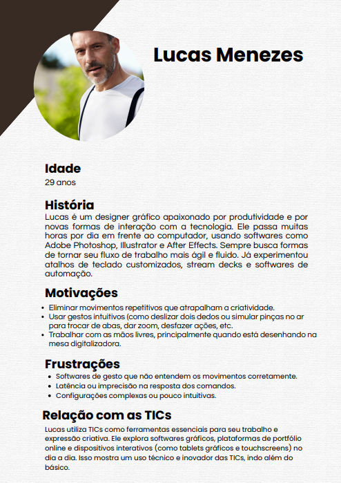

# Projeto Disciplina: Requisitos de Software

Olá! Este repositório faz parte do projeto da disciplina de Requisitos de Software da UTFPR - Campus Cornélio Procópio. 

🔗[Link do Padlet](https://padlet.com/viniciussian/kanban-uafrrybncz92z4fy)  
🔗[Link para o excalidraw]( https://excalidraw.com/#room=f1d87532f9bbabaea1f4,NYTZh_8ymW2AHqC0TZn36g)

## 1. 📌 Introdução

***1.1.  👥 Nome do Grupo***

Indicar o nome e github dos integrantes do grupo

Grupo 9

Integrantes:

👤 veterano00

👤 Tgardelli

👤 gustavolovizotto

👤 diegocorteL33T

👤 JoaoTrindade1404

***1.2.   💻 Nome do Sistema***

HandControl

***1.3.  🎯 Propósito do Sistema***

Este documento apresenta os requisitos dos usuários a serem desenvolvidos pela *`HandControl`*, fornecendo aos desenvolvedores as informações necessárias para o projeto e implementação, assim como para a realização dos testes e homologação do sistema.

O objetivo do sistema `HandControl` é permitir o controle de volume de um dispositivo (como computador ou mídia player) via gestos das mãos
capturados por uma câmera, oferecendo uma forma mais natural, rápida e acessível de interação com a máquina, especialmente útil para pessoas com dificuldade de usar dispositivos físicos.

***1.2. 🧑‍💼 Público Alvo***

Este documento se destina aos arquitetos de software, engenheiros de software, testadores, clientes... *<descrever aqui se existir mais interessados e que participarão do desenvolvimento do sistema>*

***1.3. 👤 Descrição dos usuários***

Usuários em geral que buscam mais praticidade;

Pessoas com deficiência motora ou mobilidade reduzida;

Profissionais que trabalham com som/mídia e querem controle por gestos;

Pessoas interessadas em tecnologias inovadoras e interfaces naturais.

*** 🎭 Personas:***

# 📘 Estudo de Cenários - HandControl

## 🔍 Análise da situação atual: antes da introdução de sua solução

**1. O que as pessoas fazem?**  
Elas usam teclado e mouse convencionais para executar atividades no computador.

**2. Quais os artefatos envolvidos?**  
Teclado, mouse, softwares gráficos, sistemas operacionais, aplicativos de produtividade.

**3. O que elas precisam saber?**  
Como usar dispositivos de entrada convencionais (teclado/mouse), comandos de software, atalhos de produtividade, ergonomia.

---

## 🔄 Análise das tarefas depois: como serão executadas as suas tarefas com sua solução

**1. O que as pessoas fazem?**  
Controlam o computador por meio de gestos captados pela webcam, usando o sistema HandControl.

**2. Quais os artefatos envolvidos?**  
Webcam, sistema HandControl, softwares gráficos ou de trabalho adaptados.

**3. O que elas precisam saber?**  
Gestos compatíveis com o sistema, como configurar e usar o HandControl, noções básicas de acessibilidade digital.

---

## 🎭 Cenário: Antes

### 👨‍💻 Lucas Menezes

Lucas é um designer gráfico que passa muitas horas em frente ao computador utilizando programas como Adobe Photoshop, Illustrator e After Effects. Ele costuma alternar frequentemente entre ferramentas e janelas com o uso de teclado e mouse, o que exige movimentos repetitivos. Lucas sente que o excesso dessas ações impacta sua produtividade e provoca desconfortos físicos, como dores nos punhos.

Ele tenta resolver isso criando atalhos e usando softwares de automação, mas nem sempre os resultados são eficientes. Lucas se sente frustrado principalmente quando os softwares não respondem com precisão aos comandos, o que atrasa seu fluxo criativo.

---

### 👩‍💻 Isabela Duarte

Isabela é uma programadora Fullstack e Mobile que trabalha com demandas intensas de codificação. Ela utiliza teclado e mouse durante longas jornadas, mas sofre com uma leve lesão por esforço repetitivo (LER), o que torna a digitação e uso contínuo do mouse dolorosos. Mesmo assim, ela precisa cumprir prazos rigorosos e realizar testes frequentes no computador.

Isabela já tentou usar soluções de acessibilidade, como ditado por voz e atalhos de teclado personalizados, mas sentiu que não se adaptavam bem à sua rotina. Ela se sente limitada e, às vezes, com receio de piorar sua condição de saúde.

---

## ✨ Cenário: Depois

### 👨‍💻 Lucas Menezes

Lucas agora utiliza o sistema HandControl, que permite controlar funções do computador através de gestos realizados diante da webcam. Ao configurar gestos personalizados para alternar entre ferramentas, aplicar comandos e até acionar automações, ele consegue manter o foco criativo sem interrupções físicas. A produtividade de Lucas aumenta, e ele relata menos dores e maior fluidez em seu trabalho.

Além disso, o sistema se adapta aos seus hábitos, possibilitando que ele personalize comandos conforme seu fluxo de trabalho em softwares gráficos.

---

### 👩‍💻 Isabela Duarte

Isabela adota o HandControl como alternativa ergonômica para codificação e testes. Ao usar gestos simples para executar comandos frequentes, ela reduz consideravelmente o uso contínuo do teclado e do mouse, aliviando os sintomas da LER. Ela também valoriza a interface inclusiva do sistema, que oferece feedback visual dos gestos reconhecidos.

Agora, Isabela sente que pode trabalhar com mais conforto e segurança, mantendo sua produtividade sem comprometer a saúde. Ela até colabora no desenvolvimento de novas funcionalidades do sistema, sugerindo melhorias com base em sua experiência como desenvolvedora.

---

## 2. Documentos gerais no repositório

***2.1. Requisitos Funcionais***

| Código | Requisito Funcional                              | Descrição                                                                                                         | Prioridades                                                                                   | Dependências |
|--------|--------------------------------------------------|-------------------------------------------------------------------------------------------------------------------|------------------------------------------------------------------------------------------------|-----------------------------|
| RF01   | Controle de Volume por Gestos                    | O sistema deve permitir que o usuário ajuste o volume do dispositivo utilizando gestos.                         | RF04, RF16                                                                                     |              M               |
| RF02   | Pausar/Retomar Vídeo                             | O sistema deve permitir que o usuário pause e retome a reprodução de vídeos por meio de gestos.                 | RF04, RF16                                                                                     |              M               |
| RF03   | Navegação em Mídia via Gestos                    | O sistema deve permitir que o usuário avance ou retroceda conteúdos de mídia por meio de gestos.                | RF04, RF16                                                                                     |               M              |
| RF04   | Processamento em Tempo Real                      | O sistema deve processar e executar comandos gestuais imediatamente após sua detecção.                          | —                                                                                              |               M              |
| RF05   | Mapeamento Personalizado de Gestos               | O sistema deve permitir que o usuário configure quais gestos executam quais ações.                              | RF11, RF12, RF14                                                                               |                M             |
| RF06   | Interface Intuitiva                              | O sistema deve fornecer orientações visuais e dicas contextuais para auxiliar o uso, sem necessidade de conhecimento técnico. | —                                                                                  |              C              |
| RF07   | Feedback Multimídia                              | O sistema deve fornecer feedback visual ou sonoro cada vez que um gesto for reconhecido.                        | RF04                                                                                           |                S             |
| RF08   | Ativação/Desativação do Reconhecimento de Gestos | O sistema deve permitir que o usuário ative ou desative o reconhecimento de gestos conforme sua preferência.    | RF04                                                                                           |                 M            |
| RF09   | Cadastro de Usuário                              | O sistema deve permitir que novos usuários se cadastrem.                                                         | —                                                                                              |                M             |
| RF10   | Autenticação do Usuário                          | O sistema deve permitir que usuários efetuem login de forma segura.                                              | RF09                                                                                           |                 M            |
| RF11   | Cadastro de Gestos Personalizados                | O sistema deve permitir que o usuário registre gestos próprios para comandos específicos.                       | RF12                                                                                           |                  M           |
| RF12   | Cadastro de Gestos via Câmera                    | O sistema deve permitir que o usuário cadastre novos gestos capturados por meio da câmera do dispositivo.       | —                                                                                              |                  M           |
| RF13   | Controle Sem Mouse/Teclado                       | O sistema deve permitir que o usuário controle o dispositivo exclusivamente por gestos, sem mouse ou teclado.   | RF01, RF02, RF03, RF04, RF05, RF16                                                             |                 M            |
| RF14   | Perfis de Gestos Customizados                    | O sistema deve permitir que o usuário salve perfis de gestos para diferentes atividades ou perfis de usuário.   | RF05, RF09, RF10                                                                               |                 C            |
| RF15   | Central de Ajuda Multimídia                      | O sistema deve oferecer uma central de ajuda com FAQs e suporte visual ou sonoro para auxiliar o usuário.       | RF01–RF05, RF13, RF14, RF16                                                                    |                 S            |
| RF16   | Gestos Predefinidos para Comandos Comuns         | O sistema deve incluir gestos predefinidos para comandos como pausar vídeo, ajustar volume e avançar mídias.    | —                                                                                              |                  M           |
| RF17   | Login com Conta Google e Facebook                | O sistema deve permitir que o usuário faça login utilizando contas do Google ou Facebook.                       | RF18                                                                                           |                 C            |
| RF18   | Integração com API OAuth                         | O sistema deve integrar com a API OAuth do Google e do Facebook.                                                 | —                                                                                              |                C             |
| RF19   | Recuperação de Senha                             | O sistema deve permitir que o usuário solicite a recuperação de senha.                                           | RF09, RF10                                                                                     |                 M            |
| RF20   | Redefinição de Senha                             | O sistema deve enviar um e-mail com link de redefinição de senha ao usuário.                                     | RF19                                                                                           |                 M            |
| RF21   | Histórico de Gestos Realizados                   | O sistema deve permitir que o usuário consulte o histórico de gestos realizados.                                | RF04                                                                                           |                  C           |
| RF22   | Ativar/Desativar Feedback Multimídia             | O sistema deve permitir que o usuário ative ou desative o feedback visual ou sonoro.                            | RF07                                                                                           |                  C          |

***2.2. Requisitos Não Funcionais***

| Código | Requisito Não Funcional    | Descrição                                                                                                                                                                               | Prioridade                                         |
|--------|----------------------------|-----------------------------------------------------------------------------------------------------------------------------------------------------------------------------------------|---------------------------------------------------------------|
| NFR01  | Desempenho                 | O sistema deve realizar o reconhecimento de gestos em tempo real, com tempo de resposta inferior a 100 milissegundos, garantindo fluidez e interatividade.                          | M             |
| NFR02  | Usabilidade                | O sistema deve possuir uma interface intuitiva, autoexplicativa e acessível, permitindo que usuários com diferentes níveis de conhecimento consigam operar o sistema sem complexidade.   | M                      |
| NFR03  | Confiabilidade             | O sistema deve atingir uma taxa de acerto de reconhecimento superior a 98%, minimizando falsos positivos e negativos, e garantindo consistência na operação.                     | M                |
| NFR04  | Segurança                  | O sistema deve proteger por criptografia AES os dados dos usuários, incluindo informações pessoais na conta, configurações e perfis personalizados.                                 | M             |
| NFR05  | Compatibilidade            | O sistema deve operar de maneira consistente em diferentes dispositivos (Mobile e Desktop) e sistemas operacionais (Android, IOS, Windows, Linux, MacOS), integrando com os recursos (Acesso a Câmera e Acesso Alto Falante) necessários ao reconhecimento. | S            |
| NFR06  | Escalabilidade             | O sistema deve utilizar uma arquitetura que permite a inclusão futura de novos gestos e funcionalidades, sem comprometer o desempenho ou a experiência do usuário.	                   | S                  |
| NFR07  | Manutenibilidade           | O software deve possuir uma estrutura modular e bem documentada, facilitando manutenções, correções e a implementação de melhorias futuras.                                           | S            |
| NFR08  | Portabilidade              | O sistema deve conter requisitos mínimos de hardware, tais como placa gráfica dedicada ou integrada (AMD, INTEL, NVIDIA),para assegurar seu pleno funcionamento.         | S                 |
| NFR09  | Feedback e Tratamento de Erros | O sistema deve fornecer mensagens claras e detalhadas em caso de falhas ou problemas, permitindo que o usuário entenda a causa e, quando possível, receba orientações para a resolução. | M                   |
| NFR10  | Eficiência de Recursos     | O software deve otimizar o uso dos recursos computacionais, evitando consumo excessivo de memória e processamento, mesmo em dispositivos com hardware modesto.                        | M |
| NFR11  | Compatibilidade    | O software deve ser desenvolvido utilizando a linguagem Python                        | M |
| NFR12  | Desempenho    | O sistema deve utlizar aceleração CUDA                       | S |
| NFR13   | Responsividade da Interface  | A interface gráfica do sistema deve se adaptar automaticamente a diferentes tamanhos de tela e resoluções, garantindo boa usabilidade em qualquer dispositivo. | M |
| NFR14   | Tolerância a Falhas          | O sistema deve continuar funcionando parcialmente mesmo que algumas funcionalidades estejam temporariamente indisponíveis.                           | S |
| NFR15   | Log de Atividades            | O sistema deve registrar logs das atividades dos usuários e do funcionamento do sistema para fins de auditoria e diagnóstico.                         |S |
| NFR16   | Latência de Feedback         | O tempo entre a detecção de um gesto e o feedback ao usuário não deve ultrapassar 150 milissegundos. | M |
| NFR17   | Internacionalização  | O sistema deve oferecer suporte a múltiplos idiomas, incluindo no mínimo português e inglês.                                                          | S |
| NFR18   | Atualizações Automáticas     | O sistema deve ser capaz de receber atualizações de forma automática ou semi-automática, com mínima interferência do usuário.                        | C |
| NFR20   | Isolamento de Ambiente       | O sistema deve funcionar em sandbox ou contêiner para evitar interferências com o sistema operacional principal.                                      | C |
| NFR21   | Backup de Configurações      | O sistema deve permitir o backup e restauração das configurações do usuário, incluindo perfis e gestos personalizados.                               | C |

***2.3. Perguntas***

# Roteiro Simplificado de Entrevista – HandControl

## 1. Sobre o uso de tecnologia

1.1. Você pode nos contar um pouco sobre como usa computadores ou celulares no dia a dia?  
(Aberta)

1.2. Com que frequência você usa computador?  
☐ Nunca ☐ Raramente ☐ Às vezes ☐ Frequentemente ☐ Sempre

1.3. Já usou algum recurso de acessibilidade, como comandos de voz ou leitores de tela?  
☐ Sim ☐ Não  
Se sim, qual? (Aberta)

1.4. Em que momentos do dia você costuma usar dispositivos eletrônicos?  
(Aberta)

---

## 2. Dificuldades e necessidades

2.1. Quais dificuldades você tem ao usar mouse ou teclado?  
(Aberta)

2.2. Já usou algum software de acessibilidade? Qual?  
(Aberta)

2.3. Você se sentiria seguro usando um sistema que reconhece gestos pela webcam?  
☐ Sim ☐ Não  
Por quê? (Aberta)

2.4. Já deixou de fazer alguma tarefa no computador por dificuldade de uso? Qual?  
(Aberta)

2.5. O que você costuma fazer quando tem dificuldades no computador?  
☐ Procuro tutoriais na internet  
☐ Peço ajuda a alguém  
☐ Tento resolver sozinho  
☐ Outro: ___________

---

## 3. Preferências e expectativas

3.1. Quais dessas funções você mais usa no computador?  
☐ Acesso à internet  
☐ E-mails  
☐ Redes sociais  
☐ Jogos  
☐ Vídeos  
☐ Outros: ___________

3.2. O que você esperaria de um sistema como o HandControl?  
(Aberta)

3.3. Você prefere usar mouse/teclado ou acha que o controle por gestos seria mais fácil? Por quê?  
(Aberta)

3.4. Quais dessas características são mais importantes em um sistema de acessibilidade?  
☐ Facilidade de uso  
☐ Segurança  
☐ Compatibilidade com programas  
☐ Personalização  
☐ Outro: ___________

---

## 4. Interface e usabilidade

4.1. Você se sente confortável em usar a webcam do computador?  
☐ Sim ☐ Não

4.2. Como prefere aprender a usar um novo software?  
☐ Manual escrito  
☐ Vídeo tutorial  
☐ Passo a passo com imagens  
☐ Treinamento prático

4.3. Você teria dificuldade para fazer gestos com a mão na frente da câmera? Por quê?  
(Aberta)

4.4. Já usou algum app ou jogo com reconhecimento de movimento pela câmera? Como foi?  
(Aberta)

---

## 5. Priorização de Funcionalidades (RF)

> Use a escala **MoSCoW** para indicar a prioridade:  
> - **M (Must)**: Essencial  
> - **S (Should)**: Importante  
> - **C (Could)**: Opcional  
> - **W (Won’t)**: Não necessário

5.1. Controle de Volume por Gestos (RF01): [M/S/C/W]  
5.2. Pausar/Retomar Vídeo por Gestos (RF02): [M/S/C/W]  
5.3. Mapeamento Personalizado de Gestos (RF05): [M/S/C/W]  
5.4. Cadastro de Gestos via Câmera (RF12): [M/S/C/W]  
5.5. Login com Conta Google/Facebook (RF17): [M/S/C/W]  
5.6. Histórico de Gestos Realizados (RF21): [M/S/C/W]  
5.7. Outro recurso importante? Qual? (Aberta)

---

## 6. Priorização de Requisitos Não Funcionais (NFR)

> Avalie a importância de cada item de 1 (nada importante) a 5 (muito importante):

6.1. Resposta rápida do sistema: [1–5]  
6.2. Interface simples e acessível: [1–5]  
6.3. Segurança e privacidade: [1–5]  
6.4. Funcionar em diferentes dispositivos: [1–5]  
6.5. Usar em desktop e mobile: [1–5]  
6.6. Suporte a mais de um idioma: [1–5]  
6.7. Backup e restauração de configurações: [1–5]

---

## 7. Considerações Finais

7.1. Qual funcionalidade é mais essencial para você? Por quê?  
(Aberta)

7.2. Tem alguma funcionalidade que você considera desnecessária?  
(Aberta)

7.3. Gostaria de deixar mais algum comentário ou sugestão?  
(Aberta)

***2.4. Entrevista***

*<Arquivo com as respostas do indivíduo entrevistado e link do drive com upload da gravação.>*

***2.5. Histórias do Usuário***

*<Imagem, arquivo (PDF), link com as Histórias de Usuário.>*

***2.6. Diagramas de Caso de Uso e Especificações***

*<Imagem, arquivo (PDF), link com Diagrama de Caso de Uso.>*

***2.7. Diagramas de Atividades***

*<Imagem, arquivo (PDF), link com Diagrama de Atividades.>*

***2.8. Matrizes de Rastreabilidade***

*<Imagem, arquivo (PDF), link com Matriz de Rastreabilidade.>*

***2.9. Protótipos***

prototipo não existe 0-0

## Referências

*<Esta seção é destinada à descrição das referências utilizadas pelo documento, como por exemplo, URLs e livros. Ver exemplo a seguir:>*

[1] “Glossário da _USina_”, <_id_doc glossário_>, Versão <_versão_>. Localização: <_localização_>.
